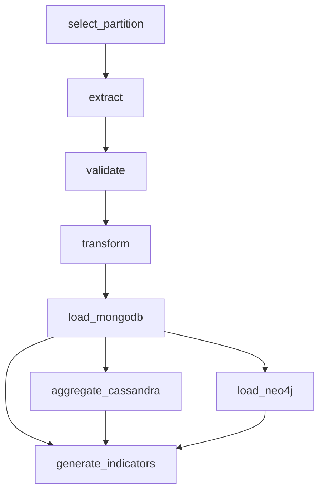
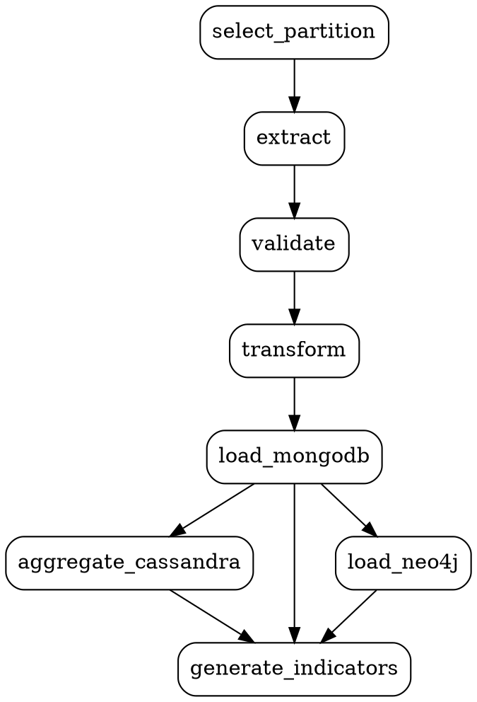

# Diagrama del DAG de Airflow

## Flujo de tareas

```mermaid
flowchart TD
    A[select_partition] --> B[extract]
    B --> C[validate]
    C --> D[transform]
    D --> E[load_mongodb]
    E --> F[aggregate_cassandra]
    E --> G[load_neo4j]
    E --> H[generate_indicators]
    F --> H
    G --> H
```

## Dependencias Graphviz

```dot
digraph DAG {
rankdir=TB;
node [shape=box, style=rounded];
  "select_partition";
  "select_partition" -> "extract";
  "extract";
  "extract" -> "validate";
  "validate";
  "validate" -> "transform";
  "transform";
  "transform" -> "load_mongodb";
  "load_mongodb";
  "load_mongodb" -> "aggregate_cassandra";
  "load_mongodb" -> "generate_indicators";
  "load_mongodb" -> "load_neo4j";
  "aggregate_cassandra";
  "aggregate_cassandra" -> "generate_indicators";
  "load_neo4j";
  "load_neo4j" -> "generate_indicators";
  "generate_indicators";
}
```
